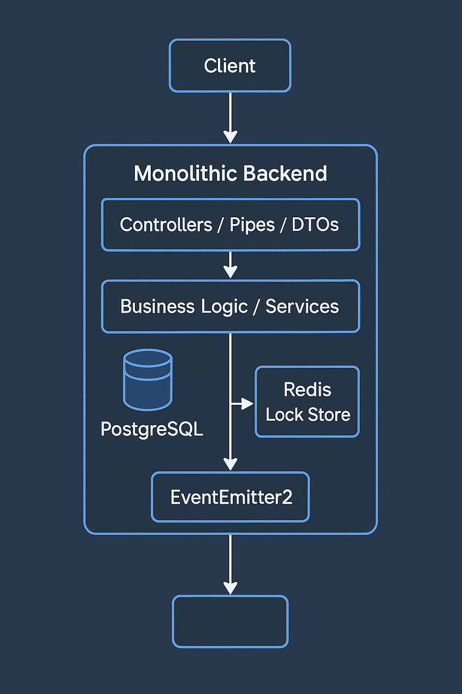

# Booking Service
## Description
This project implements a backend service designed to manage appointment bookings. The service allows for the creation, modification, and cancellation of appointments, checks the availability of providers, and maintains their schedules. The aim is to ensures reliable and efficient operation, even in a distributed system environment.

## Instructions to run
#### 1. Install dependencies: `npm install`
#### 2. Run the PosgreSQL and Redis using: `docker compose up -d`
#### 3. Setup migrations: `npx prisma migrate dev --name init --schema ./apps/prisma/schema.prisma`
#### 4. Run the Nestjs app using: `npm run start`

## System design
### Current design
A single NestJS monolith exposes REST endpoints for providers, schedules, and appointments, uses Prisma/PostgreSQL for data persistence, Redis for distributed locking, and emits domain events via EventEmitter2 to downstream consumers.

## Roadmap
### Core Implementation (Monolith)
- [X] Develop core features and REST endpoints within a unified NestJS monolith
- [X] Enforce strict request/response validation using Zod/DTOs and validation pipes

### Event-Driven Integration
- [X] Emit domain events (APPOINTMENT_CONFIRMED, …_CANCELLED, …_RESCHEDULED) via Nest’s EventEmitter2 for downstream consumers
- [ ] Add an event-driven backbone to the system by introducing a message broker (e.g. RabbitMQ or Kafka) for asynchronous communication

### Data Integrity & Concurrency
- [X] Wrap critical booking/rescheduling logic in Prisma transactions to ensure ACID safety
- [X] Implement distributed locking around slot reservations to prevent race conditions in preparation to microservice migration as well

### Microservice Extraction
- [ ] Separate the Appointments module from the monolithic application into an independent NestJS microservice
- [ ] Use gRPC for synchronous communication between the new appointments microservice and the existing system. gRPC is chosen for its high performance and built-in support for load balancing and health checking
- [ ] Deploy the appointments service behind a load balancer to allow horizontal scaling

### Database Optimizations
- [ ] Improve database read performance by adding partial indexes on appointment records that are confirmed
- [ ] Introduce materialized views to precompute slot availability
- [ ] Leverage PostgreSQL's GiST indexes and tsrange (timestamp range) types to speed up scheduling queries (e.g. checking availability or overlaps)
- [ ] Integrate Redis to cache frequently accessed metadata and availability data

### Observability & Operations
- [ ] Set up distributed tracing to track requests as they propagate through multiple services
- [ ] Add distributed tracing (OpenTelemetry) for end-to-end request visualization
- [ ] Implement health checks and metrics (Prometheus) on all services
